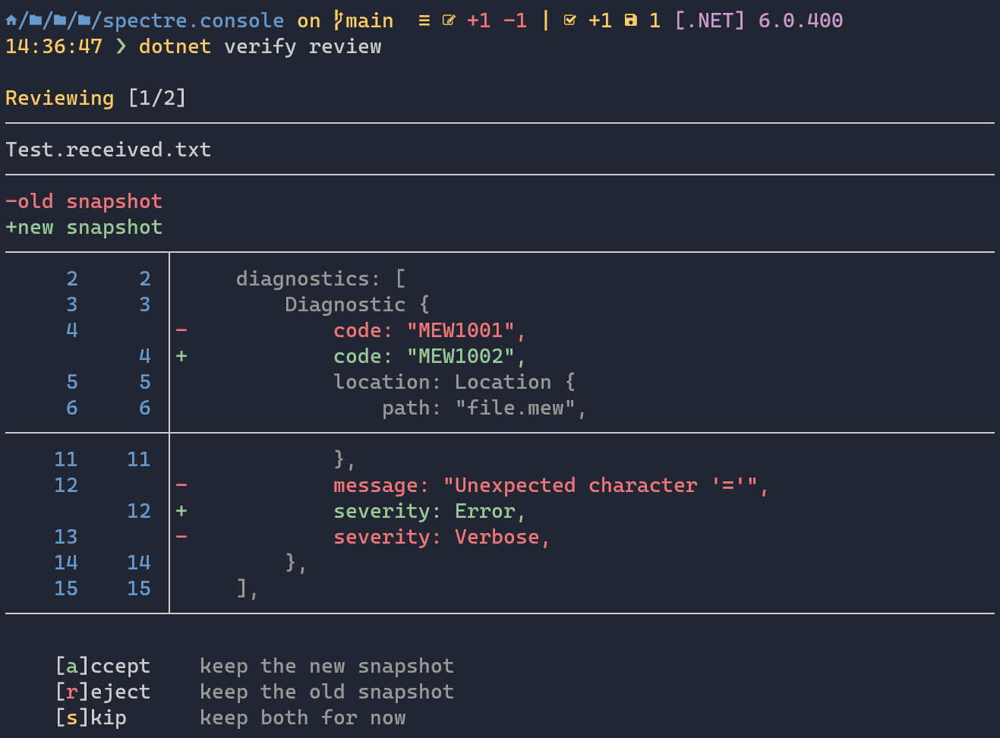

# Verify.Terminal

A dotnet tool for managing Verify snapshots.  
Inspired by the awesome [Insta](https://github.com/mitsuhiko/insta) crate.



## Installation

Install by running the following command:

```bash
dotnet tool install -g verify.tool
```

## Review pending snapshots

```
USAGE:
    verify review [OPTIONS]

OPTIONS:
    -h, --help                    Prints help information
    -w, --work <DIRECTORY>        The working directory to use
    -c, --context <LINE-COUNT>    The number of context lines to show. Defaults to 2
```

```
> dotnet verify review
```

## Accept all pending snapshots

```
USAGE:
    verify accept [OPTIONS]

OPTIONS:
    -h, --help                Prints help information
    -w, --work <DIRECTORY>    The working directory to use
    -y, --yes                 Confirm all prompts.
```

```
> dotnet verify accept
```

## Reject all pending snapshots

```
USAGE:
    verify reject [OPTIONS]

OPTIONS:
    -h, --help                Prints help information
    -w, --work <DIRECTORY>    The working directory to use
    -y, --yes                 Confirm all prompts.
```

```
> dotnet verify reject
```

## Building

We're using [Cake](https://github.com/cake-build/cake) as a 
[dotnet tool](https://docs.microsoft.com/en-us/dotnet/core/tools/global-tools) 
for building. So make sure that you've restored Cake by running 
the following in the repository root:

```
> dotnet tool restore
```

After that, running the build is as easy as writing:

```
> dotnet cake
```
