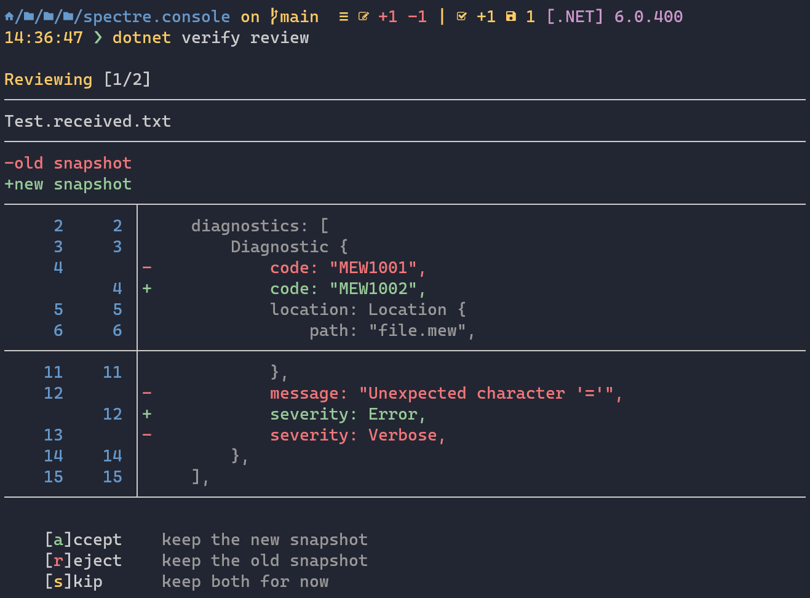
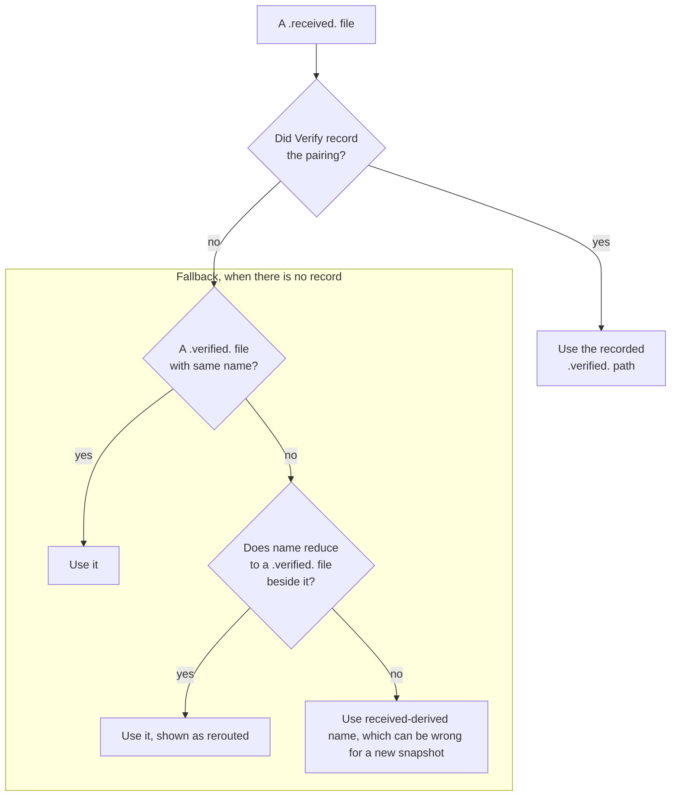

# Verify.Terminal

A dotnet tool for managing Verify snapshots.  
Inspired by the awesome [Insta](https://github.com/mitsuhiko/insta) crate.



## Installation

Install by running the following command:

```bash
dotnet tool install -g verify.tool
```

## Review pending snapshots

```
USAGE:
    verify review [OPTIONS]

OPTIONS:
    -h, --help                    Prints help information
    -w, --work <DIRECTORY>        The working directory to use
    -c, --context <LINE-COUNT>    The number of context lines to show. Defaults to 2
```

```
> dotnet verify review
```

## Accept all pending snapshots

```
USAGE:
    verify accept [OPTIONS]

OPTIONS:
    -h, --help                Prints help information
    -w, --work <DIRECTORY>    The working directory to use
    -y, --yes                 Confirm all prompts.
```

```
> dotnet verify accept
```

## Reject all pending snapshots

```
USAGE:
    verify reject [OPTIONS]

OPTIONS:
    -h, --help                Prints help information
    -w, --work <DIRECTORY>    The working directory to use
    -y, --yes                 Confirm all prompts.
```

```
> dotnet verify reject
```

## How snapshots are paired

Accepting a snapshot means moving a `.received.` file over the `.verified.` file it belongs to. Those two names are not always the same, so the tool has to work out which verified file each received file maps to. For example, a multi targeted project puts the runtime and version on the received name only:

```
MyTests.MyTest.DotNet11_0.received.txt  ->  MyTests.MyTest.verified.txt
```

Each received file is resolved in this order:


```mermaid
flowchart TD
    Start["A .received. file"] --> Recorded{"Did Verify record<br>the pairing?"}
    Recorded -->|yes| UseRecord["Use the recorded<br>.verified. path"]

    subgraph Fallback["Fallback, when there is no record"]
        SameName{"A .verified. file<br>with same name?"} -->|yes| UseSame["Use it"]
        SameName -->|no| Reduces{"Does name reduce<br>to a .verified. file<br>beside it?"}
        Reduces -->|yes| UseReduced["Use it, shown as rerouted"]
        Reduces -->|no| Derived["Use received-derived name, which can be wrong for a new snapshot"]
    end

    Recorded -->|no| SameName
```

### Recorded pairings

From [Verify 31.27.0](https://github.com/VerifyTests/Verify/issues/1809), whenever a received file is left on disk, Verify records the verified file it belongs to. This tool reads those records, so the pairing is exact rather than guessed.

A record is a two line text file, the received path then the verified path, both absolute:

```
C:\code\MyProject\Tests\MyTests.MyTest.DotNet11_0.received.txt
C:\code\MyProject\Tests\MyTests.MyTest.verified.txt
```

Records go in the intermediate (`obj`) directory of the test project rather than beside the snapshot, so they neither clutter the directory holding the code and snapshots nor get picked up by the `*.received.*` glob used to find snapshots:

```
{IntermediateDirectory}/VerifyReceived/{hash}.txt
```

 * `{IntermediateDirectory}` is the project's `IntermediateOutputPath`, captured at build time by Verify's MSBuild props and emitted into the test assembly as a `Verify.IntermediateDirectory` metadata attribute. It is per configuration and per target framework, so eg `obj/Debug/net10.0/`. A project that does not consume those props has no directory to write to, and so records nothing.
 * `{hash}` is an FNV-1a hash of the received path, as 16 hex characters. Deriving the name from the path means re running a test overwrites its record rather than accumulating one per run.

Since a record is only written when a received file is left on disk, none are written by a passing test, by [AutoVerify](https://github.com/VerifyTests/Verify/blob/main/docs/autoverify.md), which accepts in process, or on a [build server](https://github.com/VerifyTests/Verify/blob/main/docs/build-server.md), where nothing consumes them and the recorded paths do not apply off the agent.

Records outlive the received files they describe, for example once a snapshot has been accepted or its test deleted. Stale records are ignored rather than acted on, since a record is only used when the received file it names still exists. They are cleared whenever `obj` is.

To find the records, the tool scans down from the working directory for `VerifyReceived` directories, skipping `.git` and `node_modules`. So the working directory has to contain the `obj` directory, which is the case when running from a project or repository root. Pointing `-w` at a snapshot subdirectory alone means the records are not seen.

### Fallback

Where no record exists, the tool falls back to matching each received file against the verified files that sit next to it. This applies to:

 * snapshots produced by a Verify older than 31.27.0
 * an `obj` directory that is not under the working directory, as above, or that has been removed since the test run

The fallback handles the common cases, including multi targeting, `UniqueFor*`, and a trailing ignored parameter. It cannot cover everything though:

 * A brand new snapshot has no verified file to match against, so a runtime suffix cannot be removed. Accepting it produces a verified file that Verify will not read back.
 * A leading or middle ignored parameter cannot be reconstructed, since the verified name is not a truncation of the received name.

When a received file is paired with a differently named verified file, `review` shows it as `(rerouted)`.

See [Verify's file naming docs](https://github.com/VerifyTests/Verify/blob/main/docs/naming.md) for how the names are built.

## Building

```
> dotnet build.cs
```
