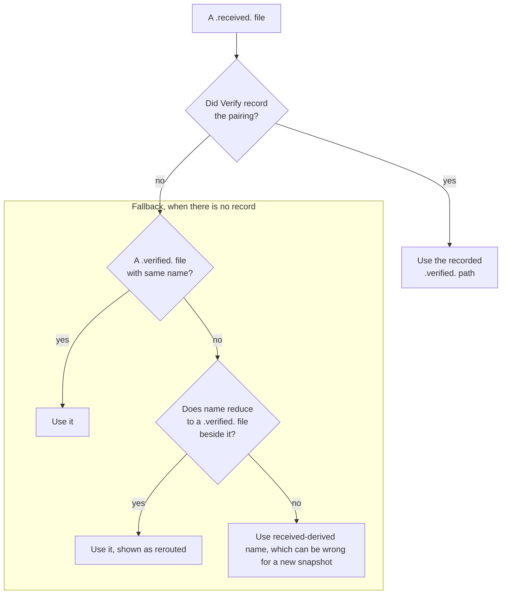

# Verify.Terminal

A dotnet tool for managing Verify snapshots.  
Inspired by the awesome [Insta](https://github.com/mitsuhiko/insta) crate.


## Installation

Install by running the following command:

```bash
dotnet tool install -g verify.tool
```

## Review pending snapshots

```
USAGE:
    verify review [OPTIONS]

OPTIONS:
    -h, --help                    Prints help information
    -w, --work <DIRECTORY>        The working directory to use
    -c, --context <LINE-COUNT>    The number of context lines to show. Defaults to 2
```

```
> dotnet verify review
```

## Accept all pending snapshots

```
USAGE:
    verify accept [OPTIONS]

OPTIONS:
    -h, --help                Prints help information
    -w, --work <DIRECTORY>    The working directory to use
    -y, --yes                 Confirm all prompts.
```

```
> dotnet verify accept
```

## Reject all pending snapshots

```
USAGE:
    verify reject [OPTIONS]

OPTIONS:
    -h, --help                Prints help information
    -w, --work <DIRECTORY>    The working directory to use
    -y, --yes                 Confirm all prompts.
```

```
> dotnet verify reject
```

## How snapshots are paired

Accepting a snapshot means moving a `.received.` file over the `.verified.` file it belongs to. Those two names are not always the same, so the tool has to work out which verified file each received file maps to. For example, a multi targeted project puts the runtime and version on the received name only:

```
MyTests.MyTest.DotNet11_0.received.txt  ->  MyTests.MyTest.verified.txt
```

Each received file is resolved in this order:


```mermaid
flowchart TD
    Start["A .received. file"] --> Recorded{"Did Verify record<br>the pairing?"}
    Recorded -->|yes| UseRecord["Use the recorded<br>.verified. path"]

    subgraph Fallback["Fallback, when there is no record"]
        SameName{"A .verified. file<br>with same name?"} -->|yes| UseSame["Use it"]
        SameName -->|no| Reduces{"Does name reduce<br>to a .verified. file<br>beside it?"}
        Reduces -->|yes| UseReduced["Use it, shown as rerouted"]
        Reduces -->|no| Derived["Use received-derived name, which can be wrong for a new snapshot"]
    end

    Recorded -->|no| SameName
```

Verify records the pairing. From [Verify 31.27.0](https://github.com/VerifyTests/Verify/issues/1809), whenever a received file is left on disk, Verify writes the verified path it belongs to into the `obj` directory of the test project. This tool reads those records, so the pairing is exact rather than guessed.

For the records to be found, the working directory has to contain the `obj` directory, which is the case when running from a project or repository root. Pointing `-w` at a snapshot subdirectory alone means they are not seen.

Where no record exists, the tool falls back to matching each received file against the verified files that sit next to it. This applies to:

 * snapshots produced by a Verify older than 31.27.0
 * an `obj` directory that is not under the working directory, as above, or that has been removed since the test run

The fallback handles the common cases, including multi targeting, `UniqueFor*`, and a trailing ignored parameter. It cannot cover everything though:

 * A brand new snapshot has no verified file to match against, so a runtime suffix cannot be removed. Accepting it produces a verified file that Verify will not read back.
 * A leading or middle ignored parameter cannot be reconstructed, since the verified name is not a truncation of the received name.

When a received file is paired with a differently named verified file, `review` shows it as `(rerouted)`.

See [Verify's file naming docs](https://github.com/VerifyTests/Verify/blob/main/docs/naming.md) for how the names are built.

## Building

```
> dotnet build.cs
```
