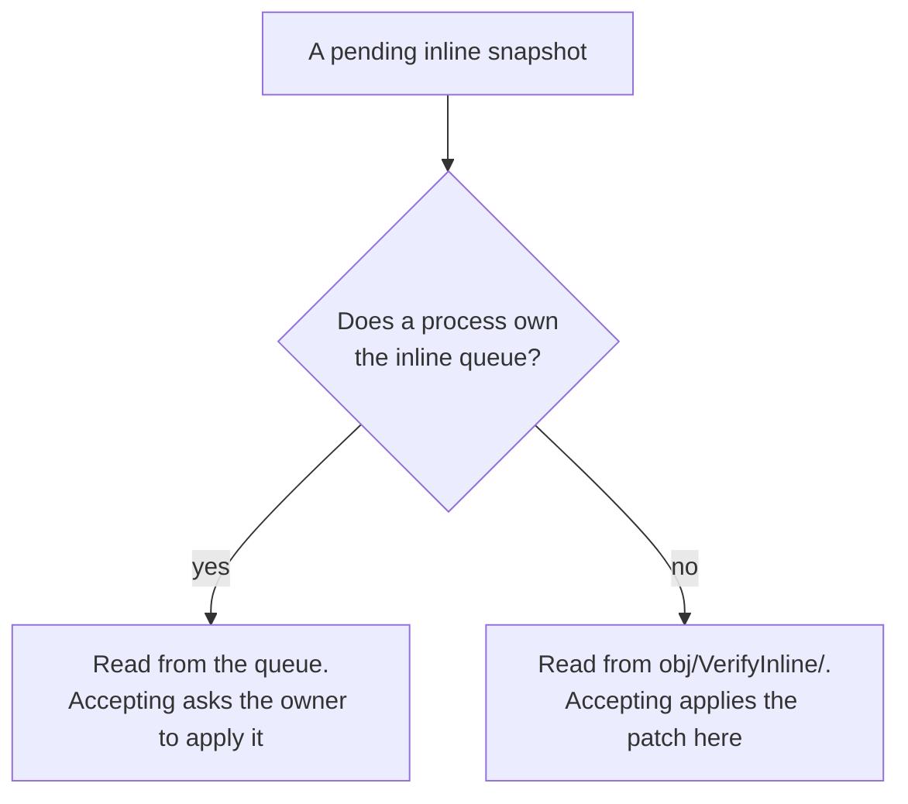
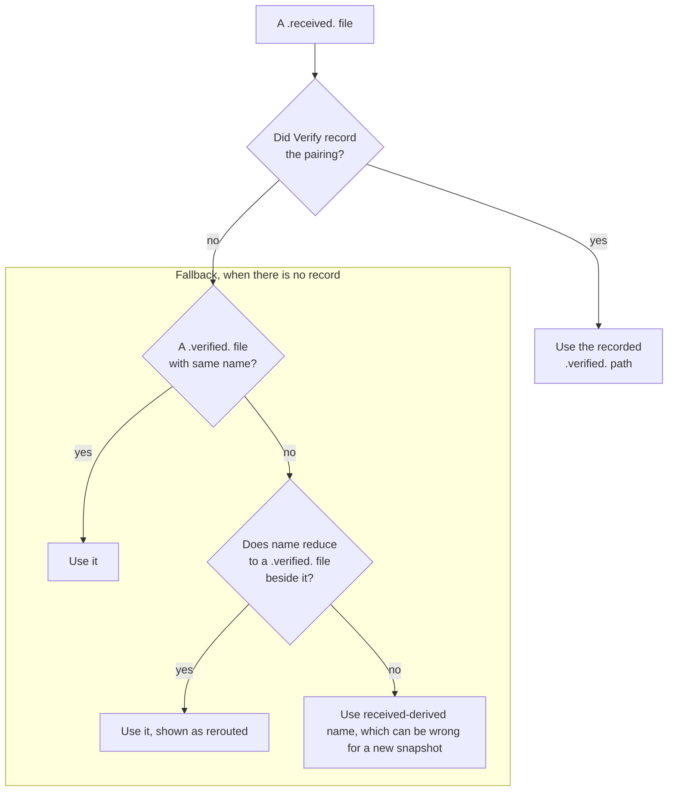

#  Verify.Terminal

[](https://www.nuget.org/packages/Verify.Tool/)

A dotnet tool for managing Verify snapshots.  
Inspired by the awesome [Insta](https://github.com/mitsuhiko/insta) crate.


## Installation

Install by running the following command:

```bash
dotnet tool install -g verify.tool
```

## Review pending snapshots

```
USAGE:
    verify review [OPTIONS]

OPTIONS:
    -h, --help                    Prints help information
    -w, --work <DIRECTORY>        The working directory to use
    -c, --context <LINE-COUNT>    The number of context lines to show. Defaults to 2
```

```
> dotnet verify review
```

## Accept all pending snapshots

```
USAGE:
    verify accept [OPTIONS]

OPTIONS:
    -h, --help                Prints help information
    -w, --work <DIRECTORY>    The working directory to use
    -y, --yes                 Confirm all prompts.
```

```
> dotnet verify accept
```

## Reject all pending snapshots

```
USAGE:
    verify reject [OPTIONS]

OPTIONS:
    -h, --help                Prints help information
    -w, --work <DIRECTORY>    The working directory to use
    -y, --yes                 Confirm all prompts.
```

```
> dotnet verify reject
```

## Inline snapshots

An [inline snapshot](https://github.com/VerifyTests/Verify/blob/main/docs/inline-snapshots.md) keeps its expected text in the test source, as a string literal beside the code that produces it, instead of in a `.verified.` file. `review`, `accept` and `reject` all handle them beside file snapshots, so a run that produced both is dealt with in one pass. Accepting one rewrites the literal in the source file rather than moving a file, and `review` shows it as `(inline)`, headed by the call site rather than by a file name:

```
────────────────────────────────────────────────────────────────────────
SampleTests.cs:42 (inline)
────────────────────────────────────────────────────────────────────────
-old snapshot
+new snapshot
```

### Where pending inline snapshots come from

Nothing is written to disk for a pending inline snapshot. The test run hands its patch to whichever process owns the inline queue, and only stages it under `obj/VerifyInline/` when nothing answers. So both are read:


```mermaid
flowchart TD
    Start["A pending inline snapshot"] --> Owner{"Does a process own<br>the inline queue?"}
    Owner -->|yes| Queued["Read from the queue.<br>Accepting asks the owner to apply it"]
    Owner -->|no| Staged["Read from obj/VerifyInline/.<br>Accepting applies the patch here"]
```

Accepting through the owner rather than here is what keeps one writer per source file, and leaves the tray, the viewer and this tool agreeing about what is still pending. The owner is [DiffEngineTray](https://github.com/VerifyTests/DiffEngine/blob/main/docs/tray.md) when one is running, and otherwise the [DiffEngineViewer](https://github.com/VerifyTests/DiffEngine/blob/main/docs/viewer.md) a test run launched.

Staged snapshots live in the intermediate (`obj`) directory of the test project, so, as with [recorded pairings](#recorded-pairings), the working directory has to contain `obj`.

### Snapshots that cannot be accepted

A snapshot that refuses says why, and does not stop the rest of the run being processed. Two cases:

 * **Conflicting snapshots.** A multi targeted run whose frameworks disagreed about the content has one snapshot per framework for the same call site. Only the first can be shown, so accepting is refused rather than picking between them silently. Resolve it in DiffEngineViewer, or re-run the tests so the frameworks agree.
 * **The call site could not be found.** The literal is located by content, so an edit that moves it is fine, but one that changes or removes the `Snapshot(...)` call means the patch no longer matches anything. Re-run the test and accept again.

## How snapshots are paired

Accepting a file snapshot means moving a `.received.` file over the `.verified.` file it belongs to. Those two names are not always the same, so the tool has to work out which verified file each received file maps to. For example, a multi targeted project puts the runtime and version on the received name only:

```
MyTests.MyTest.DotNet11_0.received.txt  ->  MyTests.MyTest.verified.txt
```

Each received file is resolved in this order:


```mermaid
flowchart TD
    Start["A .received. file"] --> Recorded{"Did Verify record<br>the pairing?"}
    Recorded -->|yes| UseRecord["Use the recorded<br>.verified. path"]

    subgraph Fallback["Fallback, when there is no record"]
        SameName{"A .verified. file<br>with same name?"} -->|yes| UseSame["Use it"]
        SameName -->|no| Reduces{"Does name reduce<br>to a .verified. file<br>beside it?"}
        Reduces -->|yes| UseReduced["Use it, shown as rerouted"]
        Reduces -->|no| Derived["Use received-derived name, which can be wrong for a new snapshot"]
    end

    Recorded -->|no| SameName
```

### Recorded pairings

From [Verify 31.27.0](https://github.com/VerifyTests/Verify/issues/1809), whenever a received file is left on disk, Verify records the verified file it belongs to. This tool reads those records, so the pairing is exact rather than guessed.

The records live in the intermediate (`obj`) directory of the test project, so the working directory has to contain `obj`, which is the case when running from a project or repository root. Pointing `-w` at a snapshot subdirectory alone means the records are not seen.

See [Verify's received map docs](https://github.com/VerifyTests/Verify/blob/main/docs/naming.md#received-map-file) for how the records are written and read.

### Fallback

Where no record exists, the tool falls back to matching each received file against the verified files that sit next to it. This applies to:

 * snapshots produced by a Verify older than 31.27.0
 * an `obj` directory that is not under the working directory, as above, or that has been removed since the test run

The fallback handles the common cases, including multi targeting, `UniqueFor*`, and a trailing ignored parameter. It cannot cover everything though:

 * A brand new snapshot has no verified file to match against, so a runtime suffix cannot be removed. Accepting it produces a verified file that Verify will not read back.
 * A leading or middle ignored parameter cannot be reconstructed, since the verified name is not a truncation of the received name.

When a received file is paired with a differently named verified file, `review` shows it as `(rerouted)`.

See [Verify's file naming docs](https://github.com/VerifyTests/Verify/blob/main/docs/naming.md) for how the names are built.

## Building

```
> dotnet build.cs
```
